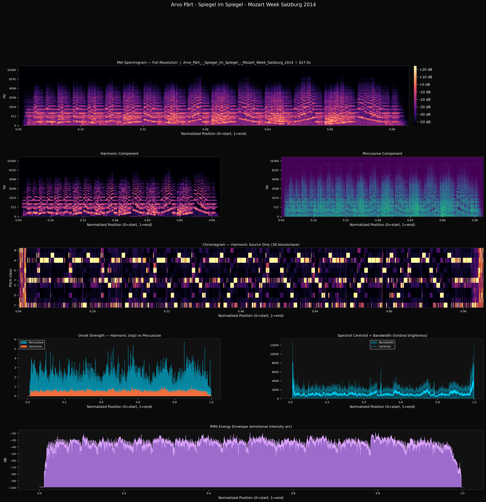

# beautifulyze

**Render a piece of music into a picture a language model can read.**

Hand an LLM a raw waveform and it learns almost nothing. Hand it *this* — eight
aligned views of the same track on one normalized timeline, plus a compact
numeric digest — and it can reason about structure, harmony, dynamics, and
timbre at a glance.

`beautifulyze` takes one audio file and produces two things:

1. a multi-panel **PNG** (mel spectrogram, harmonic/percussive split,
   chromagram, onset strength, spectral centroid + bandwidth, and an RMS energy
   arc), and
2. a small **JSON digest** — tempo, key, dynamics, brightness, harmonicity,
   onset rate — topped with a one-line caption that grounds the model's reading
   in hard numbers.



The image above is Arvo Pärt's *Spiegel im Spiegel*. You can *read* it: the
harmonic panel shows steady, near-metronomic piano arpeggios; the chromagram
holds one calm tonal center for ten unbroken minutes; the RMS arc is almost
flat — the famous stillness of Pärt's tintinnabuli — lifting only once, gently,
near the end. Almost nothing "happens," and yet the structure is unmistakable.
That legibility is the whole point.

## Why

This started as a way to let an LLM *experience* music it cannot hear. A
spectrogram alone is dense and easy to misread; a pile of numbers has no shape.
Putting both in front of the model — a picture for gestalt, a digest for
precision — lets it describe a piece the way a careful listener would.

## Quick start

```bash
# 1. System dependency: ffmpeg (decodes mp3 / mp4 / m4a / …)
sudo apt install ffmpeg        # or: brew install ffmpeg

# 2a. Install as a command…
pip install .
beautifulyze song.flac

# 2b. …or just run the script
pip install -r requirements.txt
python beautifulyze.py song.flac
```

Either way you get `song.png` and `song.json` next to where you ran it.

## Usage

```bash
beautifulyze track.mp3                 # → track.png + track.json
beautifulyze track.mp3 -o out.png      # choose the output path
beautifulyze track.mp3 --no-normalize  # x-axis in wall-clock seconds, not 0–1
beautifulyze track.mp3 --no-digest     # picture only, skip the JSON
beautifulyze album/                    # render every audio file in a folder
```

| Flag | Default | Purpose |
|------|---------|---------|
| `-o, --output` | `<name>.png` | Output PNG path (single input only) |
| `--no-normalize` | off | Use wall-clock time instead of a 0–1 position on the x-axis |
| `--no-digest` | off | Skip the JSON digest |
| `--n-mels` | 256 | Mel bands (vertical resolution of the spectrograms) |
| `--hop-length` | 256 | STFT hop (horizontal/time resolution) |
| `--hpss-margin` | 3.0 | Harmonic/percussive separation aggressiveness |
| `--dpi` | 180 | Output PNG resolution |

The x-axis defaults to a **normalized 0–1 position** so two tracks of different
lengths line up for side-by-side comparison.

## Reading the panels

| Panel | What it shows | What to look for |
|-------|---------------|------------------|
| **Mel spectrogram** | Full energy across frequency over time | Overall texture, register, density |
| **Harmonic component** | Pitched material (HPSS) | Melody, chords, sustained tones |
| **Percussive component** | Transient material (HPSS) | Drums, attacks, rhythmic drive |
| **Chromagram** | Energy folded into 12 pitch classes | Key, harmonic movement, repetition |
| **Onset strength** | Note-onset energy, harmonic vs percussive | Rhythmic density and where it lives |
| **Centroid + bandwidth** | Spectral "brightness" and its spread | Timbre, brightening/darkening arcs |
| **RMS energy** | Loudness envelope in dB | The dynamic/emotional arc of the piece |

## The digest

Every render writes a sibling `.json`. For Portishead's *Glory Box*:

```json
{
  "source": "Portishead_-_Glory_Box.mp4",
  "duration_sec": 307.11,
  "tempo_bpm": 120.2,
  "tempo_is_estimate": true,
  "key": { "tonal_center": "C", "mode": "minor", "confidence": 0.4 },
  "dynamics": { "mean_db": -18.4, "range_db": 38.8 },
  "brightness": { "mean_hz": 1892.4, "trend": "rising" },
  "harmonicity": 0.973,
  "onset_rate": 3.777,
  "caption": "~120 BPM, C minor, wide dynamic range, warm timbre (rising), strongly harmonic."
}
```

| Field | Meaning |
|-------|---------|
| `tempo_bpm` | Estimated tempo. `tempo_is_estimate` is always true — beat tracking is unreliable on rubato and ambient material, so treat it as a hint. |
| `key` | Best-fit key via Krumhansl–Schmuckler correlation, with a 0–1 `confidence`. Low confidence (e.g. 0.4 above) is honest, not a bug. |
| `dynamics` | Mean loudness and a silence-robust dynamic range (95th − 5th percentile), in dB. |
| `brightness` | Mean spectral centroid in Hz, and whether it's `rising`, `falling`, or `steady`. |
| `harmonicity` | Fraction of energy that is harmonic: `1.0` = purely tonal, `0.0` = purely percussive. |
| `onset_rate` | Note onsets per second — rhythmic density. |
| `caption` | A single grounded sentence stitched from the fields above. |

## Using it with an LLM

```bash
beautifulyze song.flac
```

Attach `song.png` to your model of choice, paste `song.json`, and ask it to
read the music. A prompt that works well:

> Here is a multi-panel visualization of a piece of music and a numeric digest
> of it. Using the panel legend (mel spectrogram, harmonic/percussive split,
> chromagram, onset strength, spectral centroid/bandwidth, RMS energy),
> describe this piece: its structure, mood, dynamics, and how it evolves.

The digest keeps the model honest (it can cite the actual tempo, key, and
dynamic range), and the picture gives it the shape the numbers can't.

## Examples

The [`examples/`](examples/) gallery renders a deliberately wide spread — from
Pärt's near-motionless minimalism through Marconi Union's ambient *Weightless*
suite to Portishead's beat-driven *Glory Box*. Put the ambient renders next to
Portishead and the contrast is immediate: flat versus dramatic RMS arcs, near-
empty versus busy percussive panels, dark versus rising brightness.

## Roadmap

- **Structural segmentation** — detect and shade musical form (e.g. ABA) on the
  timeline.
- **Beat-grid overlay** — draw the estimated beat/downbeat grid.
- **Light theme** — a print-friendly palette.

## Development

```bash
python -m venv .venv && . .venv/bin/activate
pip install -e ".[test]"
python -m pytest
```

The digest computation is covered by unit tests on synthetic signals; the
pipeline end-to-end is covered by a regression test that synthesizes a 440 Hz
tone (concert A) and checks the digest reads it correctly.

## License

Apache 2.0 — see [LICENSE](LICENSE). Copyright 2026 UIST Labs, LLC.

The audio recordings used to generate the example renders are **not** included
and are the property of their respective rights holders.
