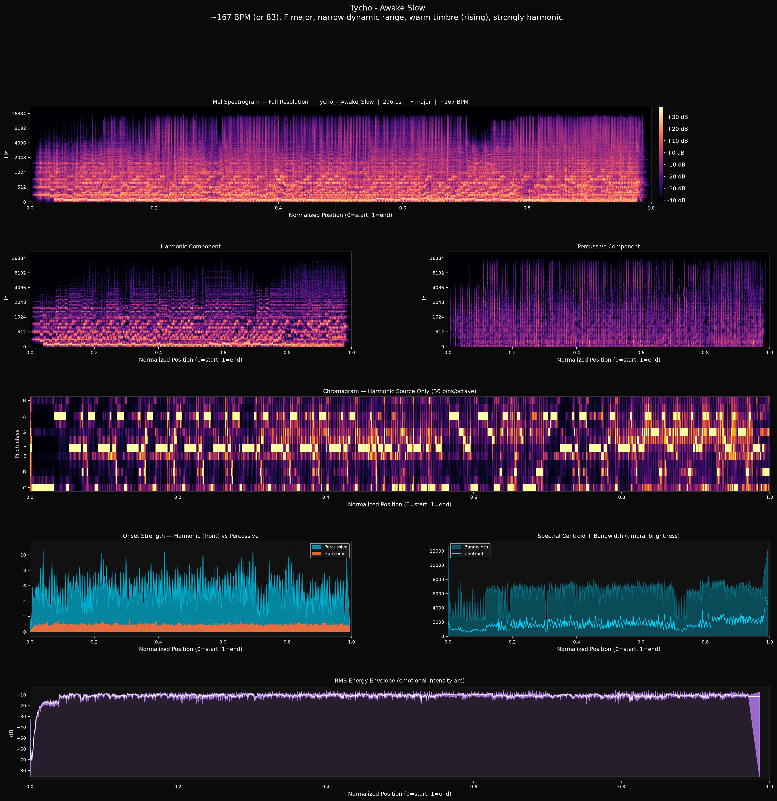
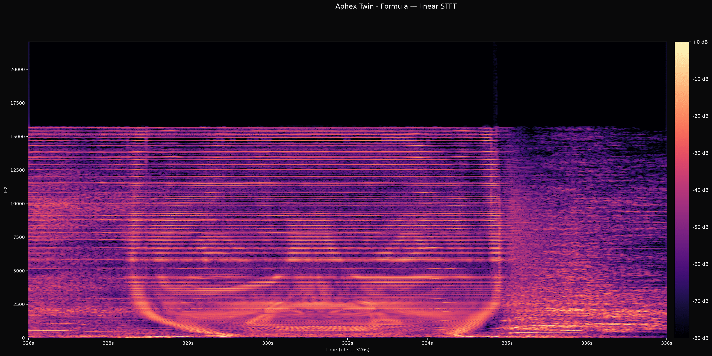

# beautifulyze

Render an audio file into a multi-panel image and a numeric summary, both
intended to be read by a language model.

A model given a raw waveform has little to work with. `beautifulyze` produces
two artifacts from one audio file:

1. a **PNG** containing seven panels on a shared timeline — mel spectrogram,
   harmonic/percussive split, chromagram, onset strength, spectral centroid with
   bandwidth, and an RMS energy envelope; and
2. a **JSON digest** — tempo, key, dynamics, brightness, harmonicity, onset
   rate — with a one-line caption assembled from those fields.



The panels are aligned, so features can be traced vertically between them: a
transient in the onset panel corresponds to a column in the percussive
spectrogram and to a step in the RMS envelope at the same x-position. The three
mel panels share one dB window, so the harmonic and percussive components can be
compared directly by brightness rather than only by shape.

## Approach

A spectrogram alone is dense and easy to misread. A set of summary statistics
has no shape. Supplying both — an image for structure, a digest for specific
values — lets a model describe a piece without inventing numbers it cannot
measure.

Estimates are labelled as estimates. Beat tracking picks one metrical level out
of several a signal may support, and key detection on ambiguous material is a
correlation, not a fact. Both are reported with the alternatives and confidence
scores attached rather than as single values.

## Install

Requires **ffmpeg** on `PATH` for compressed containers (mp4, m4a, aac):

```bash
sudo apt install ffmpeg        # or: brew install ffmpeg
```

### With uv

Run it without installing anything:

```bash
uvx --from git+https://github.com/uist-labs/beautifulyze beautifulyze song.flac
```

Or clone and work in the project:

```bash
git clone https://github.com/uist-labs/beautifulyze
cd beautifulyze
uv sync
uv run beautifulyze song.flac
```

To install it as a persistent command:

```bash
uv tool install git+https://github.com/uist-labs/beautifulyze
beautifulyze song.flac
```

### With pip

```bash
pip install .
beautifulyze song.flac
```

Either path writes `song.png` and `song.json` beside the input.

## Usage

```bash
beautifulyze track.mp3                 # -> track.png + track.json
beautifulyze track.mp3 -o out.png      # choose the output path
beautifulyze track.mp3 --no-normalize  # x-axis in seconds instead of 0-1
beautifulyze track.mp3 --no-digest     # image only
beautifulyze album/                    # every audio file in a directory
beautifulyze track.mp3 --linear --start 326 --end 338   # linear STFT window
```

| Flag | Default | Purpose |
|------|---------|---------|
| `-o, --output` | `<name>.png` | Output PNG path (single input only) |
| `--linear` | off | Render a linear-frequency STFT instead of the mel figure |
| `--start` / `--end` | - | Trim to a time window (seconds) before rendering |
| `--no-normalize` | off | Use seconds instead of a 0-1 position on the x-axis |
| `--no-digest` | off | Skip the JSON digest |
| `--n-mels` | 256 | Mel bands (vertical resolution of the spectrograms) |
| `--hop-length` | 256 | STFT hop (time resolution) |
| `--hpss-margin` | 3.0 | Harmonic/percussive separation aggressiveness |
| `--n-fft` | 4096 | STFT window for `--linear` |
| `--dpi` | 180 | Output PNG resolution |

The x-axis defaults to a normalized 0-1 position so tracks of different lengths
can be compared side by side. Directory input continues past a file that fails
to decode and reports the failures at the end.

## Reading the panels

| Panel | What it shows | What to look for |
|-------|---------------|------------------|
| Mel spectrogram | Energy across frequency over time | Texture, register, density |
| Harmonic component | Pitched material (HPSS) | Melody, chords, sustained tones |
| Percussive component | Transient material (HPSS) | Drums, attacks, rhythmic drive |
| Chromagram | Energy folded into 12 pitch classes | Key, harmonic movement, repetition |
| Onset strength | Note-onset energy, harmonic vs percussive | Rhythmic density and where it sits |
| Centroid + bandwidth | Spectral brightness and its spread | Timbre, brightening or darkening |
| RMS energy | Loudness envelope in dB | Dynamic arc, section boundaries |

On a full-length track there are far more analysis frames than horizontal
pixels — a ten-minute piece at the default hop produces roughly 100,000 frames.
The three line panels are drawn as a per-pixel min/max envelope with a mean
trend line over it, so peaks and troughs survive at any duration instead of
filling solid.

## The digest

Every render writes a sibling `.json`:

```json
{
  "source": "Tycho_-_Awake_Slow.mp4",
  "duration_sec": 296.1,
  "sample_rate": 44100,
  "tempo_bpm": 166.7,
  "tempo_is_estimate": true,
  "tempo_candidates": [
    { "bpm": 166.7, "support": 1.0 },
    { "bpm": 111.1, "support": 0.755 },
    { "bpm": 83.4, "support": 0.602 }
  ],
  "key": { "tonal_center": "F", "mode": "major", "confidence": 0.702 },
  "dynamics": { "mean_db": -12.0, "range_db": 8.4 },
  "brightness": { "mean_hz": 1737.6, "trend": "rising" },
  "harmonicity": 0.976,
  "onset_rate": 5.579,
  "caption": "~167 BPM (or 83), F major, narrow dynamic range, warm timbre (rising), strongly harmonic."
}
```

| Field | Meaning |
|-------|---------|
| `tempo_bpm` | Estimated tempo. `tempo_is_estimate` is always true; beat tracking is unreliable on rubato and ambient material. |
| `tempo_candidates` | Metrical levels the onset envelope supports, with strength relative to the strongest. A tracker that reports 167 BPM on slow material has often locked onto a subdivision; the half-time reading appears here when the signal supports it. |
| `key` | Best-fit key by Krumhansl-Schmuckler correlation, with a 0-1 `confidence`. Values below 0.6 are hedged in the caption. |
| `dynamics` | Mean loudness and a silence-robust dynamic range (95th - 5th percentile), in dB. |
| `brightness` | Mean spectral centroid in Hz, and whether it is `rising`, `falling`, or `steady`. |
| `harmonicity` | Fraction of energy that is harmonic: `1.0` is purely tonal, `0.0` purely percussive. |
| `onset_rate` | Note onsets per second. |
| `caption` | One sentence assembled from the fields above, also printed on the image. |

## Using it with a model

```bash
beautifulyze song.flac
```

Attach `song.png`, paste `song.json`, and ask for a reading. A prompt that works:

> Here is a multi-panel visualization of a piece of music and a numeric digest
> of it. Using the panel legend (mel spectrogram, harmonic/percussive split,
> chromagram, onset strength, spectral centroid/bandwidth, RMS energy),
> describe this piece: its structure, mood, dynamics, and how it evolves.

The digest supplies values the model would otherwise have to guess at, and the
caption carries the same uncertainty the JSON does, so an ambiguous tempo or a
low-confidence key is visible in the image itself.

## Linear-frequency renders (`--linear`)

The default panels use a mel frequency scale, which suits musical structure but
warps frequency and therefore distorts anything drawn into a spectrogram
deliberately. `--linear` renders a single-panel linear-frequency STFT instead.
Combine it with `--start` and `--end` to isolate a window.

The standard test case is Aphex Twin's "ΔMi⁻¹=−αΣn=1NDi[n]…" (informally
*[Equation]* or *Formula*), which encodes an image of the artist's face in the
spectrogram of its closing seconds:

```bash
beautifulyze "Aphex Twin - Formula.mp4" --linear --start 326 --end 338 --no-digest
```



The source used here is a lossy copy band-limited to about 16 kHz, which clips
the top of the image. The same view will show any content placed in the
frequency domain this way.

## Examples

The [`examples/`](examples/) gallery covers a deliberately wide range: Pärt's
minimalism, Marconi Union's ambient *Weightless* suite, and Portishead's
beat-driven *Glory Box*. Comparing the ambient renders against Portishead shows
the contrast the panels are designed to expose — flat against dramatic RMS
arcs, sparse against dense percussive panels.

## Development

```bash
uv sync --extra test
uv run pytest
uv run ruff check .
uv run ruff format .
```

Optional pre-commit hooks are configured in `.pre-commit-config.yaml`:

```bash
uv tool install pre-commit && pre-commit install
```

Tests synthesize their own fixtures — tones, pulse trains, transcoded clips —
so the suite never depends on the example audio, which is not in the repository.
Coverage includes the digest on synthetic signals, an end-to-end run that checks
a 440 Hz tone reads as concert A, both decode paths, and the envelope reduction
used by the line panels.

CI runs lint and the test suite on Python 3.9, 3.11, and 3.13, with ffmpeg
installed so the decoder tests run rather than skip. Dependencies are resolved
fresh and uncached on every run: v0.1.0 shipped a defect because librosa 1.0
removed the `audioread` fallback and a floating `librosa>=0.11` requirement
picked it up silently. A weekly scheduled run surfaces the next such change on
its own. Committing `uv.lock` gives reproducible local environments while CI
continues to test an unpinned resolve.

## License

Apache 2.0 — see [LICENSE](LICENSE). Copyright 2026 UIST Labs, LLC.

The audio recordings used to generate the example renders are not included and
remain the property of their respective rights holders.
